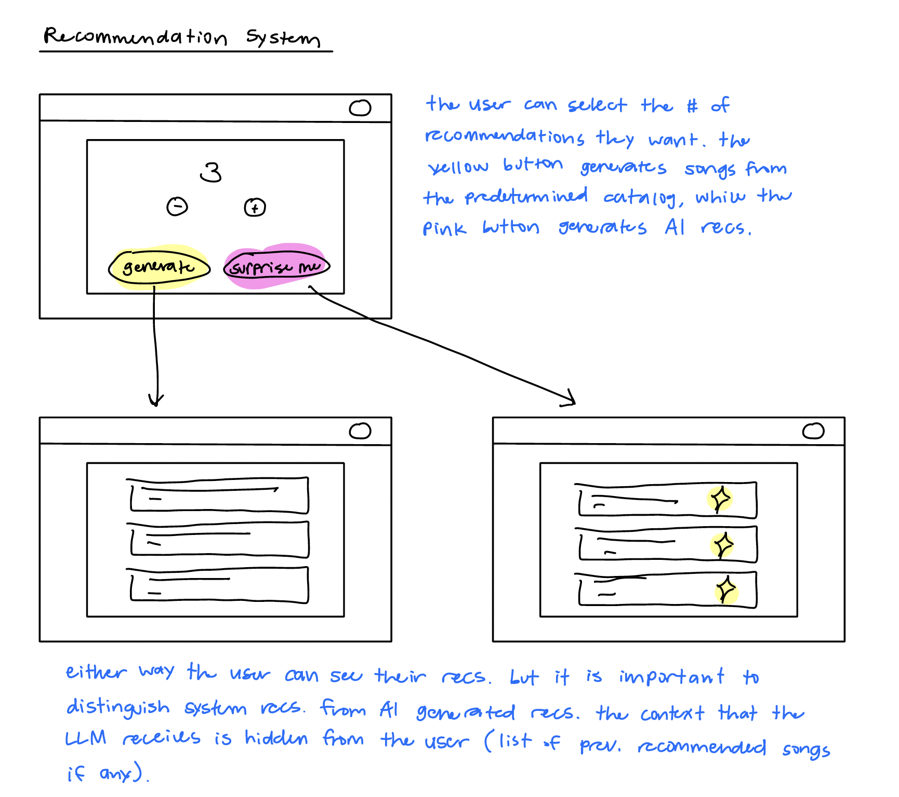

# Assignment 3: An AI-Augmented Concept
## Augment the design of a concept
### Un-augmented design
**concept** SongRecommender\
**purpose** To introduce a new song for the user each day\
**principle** Each day, the system presents a new song to the user, chosen from a list of songs. The user can listen to the song. Recommendations refresh daily and past recommendations can be revisited.\
**state**\
&nbsp;&nbsp; a set of `RecommendedSongs` with\
&nbsp;&nbsp;&nbsp;&nbsp; a name String\
&nbsp;&nbsp;&nbsp;&nbsp; an artist String\
&nbsp;&nbsp;&nbsp;&nbsp; a genre String\
&nbsp;&nbsp; a set of `NotYetRecommendedSongs` with\
&nbsp;&nbsp;&nbsp;&nbsp; a name String\
&nbsp;&nbsp;&nbsp;&nbsp; an artist String\
&nbsp;&nbsp;&nbsp;&nbsp; a genre String\
**actions**\
&nbsp;&nbsp; `generateRecommendation()`\
&nbsp;&nbsp;&nbsp;&nbsp; **effect** create a new daily recommendation and add it to `RecommendedSongs`\
&nbsp;&nbsp;`addSong(song: Song)`\
&nbsp;&nbsp;&nbsp;&nbsp; **requires** song to not be recommended yet\
&nbsp;&nbsp;&nbsp;&nbsp; **effect** adds song to the catalog of songs to be selected\
&nbsp;&nbsp;`removeSong(song: Song)`\
&nbsp;&nbsp;&nbsp;&nbsp;**requires** song to be in `NotYetRecommendedSongs`\
&nbsp;&nbsp;&nbsp;&nbsp;**effect** removes song from `NotYetRecommendedSongs`

`addSong()` is intended for manual use, when we want to add to the catalog of songs to eventually be recommended. `generateRecommendation()` is then called to choose a song from this catalog and move it to the `RecommendedSongs` set.
### Additions/Modifications for AI-Augmented Concept
`generateRecommendation(count: Number)`\
&nbsp;&nbsp; **effect** create `count` new recommendations\
`generateRecommendationFromLLM(count: Number, basisSongs?: Song[])`\
&nbsp;&nbsp; **effect** If recommended songs is passed in, the LLM will generate `count` recommendations based on the songs that were already recommended. If recommended songs is not passed in, the LLM will generate `count` songs that are "trending".

The goal here is to use the LLM instead of a complex recommendation system. We will attempt to make the LLM return a structured output of song name, artist, genre, etc. The `count` many recommendations is an attempt to add some complexity to the request we sent to the LLM.

## Design the user interaction



## Implement your concept
See the implementation in [songrecommender.ts](./songrecommender.ts)\
See the tests in [songrecommender-tests.ts](./songrecommender-tests.ts) and run with `npm start`\
See the concept spec in [songrecommender.spec](./songrecommender.spec)\
The initial testing suite includes 3 tests: manual recommendation, LLM recommendation, and removal of a song. This covers the bare-bones functionality of every action in our concept.
## Explore richer test cases and prompts
See the added tests in [songrecommender-tests.ts](./songrecommender-tests.ts). In addition to outputting the correct format of data, the LLM must also output the correct number of songs. Additionally we test that the LLM is able to provide diverse recommendations when given a list of input songs.

Additional test one (test 4 in the suite) tests that the LLM is able to generate multiple songs if requested. This is simply done by requesting the LLM to generate more than 1 song. The LLM doesn't seem to have a hard time generating the correct length of songs. 

Additional test two (test 5 in the suite) gives the LLM a basis to recommend on. When I provide this basis of songs, it does not provide a diverse recommendation compared to the basis (reminder that we want the LLM to recommend a very different song so the user can grow their music taste). I was able to get around this by using stronger language in the prompt and moving this requirement to the critical section. After this I saw much more diverse results.

Additional test three (test 6 in the suite) combines the above two behaviors into one use case. The user has some recommended songs in the past, and we ask the LLM to generate >1 songs that are different from the basis. This works as expected, since I was able to get the above behaviors to work correctly.
## Add validators to your code
1) The LLM may duplicate a recommendation in a single output. When we ask the LLM to generate recommendations and `count > 1`, we can reinforce correct behavior by using stronger language in the prompt and checking the output of the LLM manually. I added:
```
if (!Array.isArray(songs) || songs.length !== count) {
    throw new Error(`LLM did not return exactly ${count} songs. Got ${Array.isArray(songs) ? songs.length : 'invalid response'}`);
}
```
2) The LLM may recommend a song that the user has already received as a recommendation in the past. This is possible especially as the basis of recommendation gets big. Similar to the previous problem, we can reinforce the prompt and check manually. I added this to the prompt: 4. DO NOT RECOMMEND SONGS THAT ARE ALREADY IN THE CATALOG. 5. DO NOT RECOMMEND THE SAME SONG TWICE.
3) The LLM may hallucinate songs that don't actually exist. This is the toughest problem to solve because without a database of every song, there isn't a good way to guarantee the an outputted song exists. However, there are ways to mitigate this like reinforcing the prompt and feeding the output into another API call that would validate that the songs exist. This was done by implementing `verifySongsExistPrompt()` and `parseVerifySongsExistResponse()`. 


